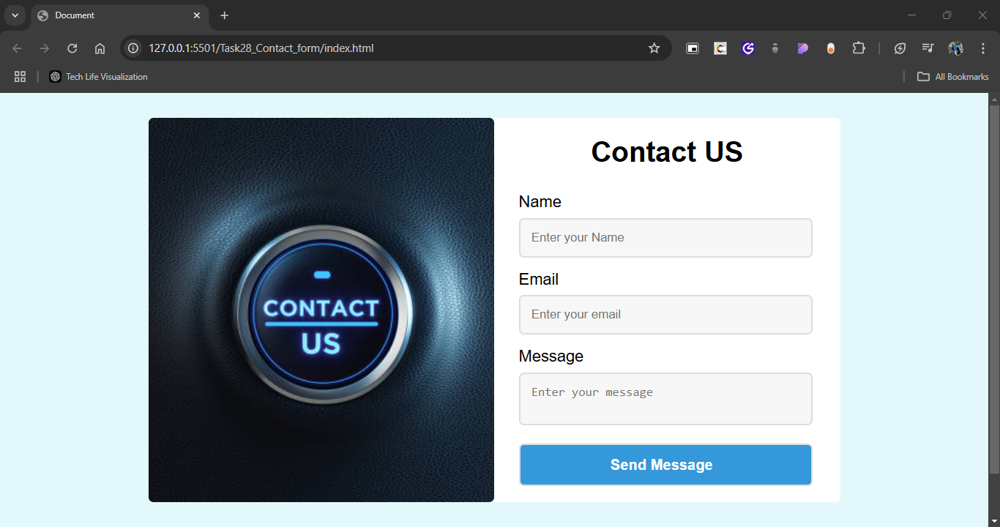

# Task 28 Contact From

# Contact Form - Landing Page

A clean and visually engaging contact form designed for a landing page, featuring a simple layout with an image and form side-by-side. This contact form is built with HTML and CSS and is fully responsive to provide a user-friendly experience on all devices.

## Demo



## Features

- **Clean, modern design** for a landing page contact form.
- **Responsive layout** using Flexbox, adjusting seamlessly across devices.
- **Hover effects and animations** to enhance user engagement.
- **Easy-to-use form elements** for Name, Email, and Message fields.
- **Subtle background and focused state** for form inputs to guide the user’s eye.

## Project Structure

```plaintext
├── index.html       # HTML layout for the contact form
├── style.css        # CSS styling for the form and layout
└── assets
    └── photos
        └── contact-us.png    # Image used in the contact form

```
